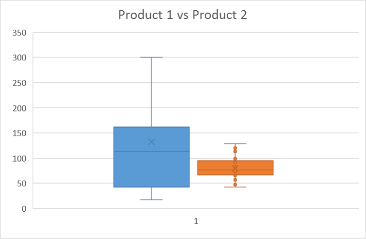

# Module 2 Quiz Review

### Question 1
You are working in Excel with a large table of data that includes a column of student scores.

You want to highlight the scores in the table so you can find the rows for the students who scored the top 10% of grades more easily.

Which Excel visualization should you use?

- Sparkline
- **Conditional Formatting**
- Slicer
- PivotTable

### Question 2

You are exploring a large table of sensor data in Excel, which contains the daily count of activations for two sensors named Sensor 1 and Sensor 2.

An extract from the table is shown below:

```
Date	        Sensor	        Counts
01/01/2016	Sensor 1	15423
01/01/2016	Sensor 2	16923
01/02/2016	Sensor 1	14963
01/02/2016	Sensor 2	17561
01/02/2016	Sensor 2	17561
01/03/2016	Sensor 1	14143
01/03/2016	Sensor 2	16157
```
What should you do to address the data quality issue evident in this sample?

- Modify values for the date column based on the date in the first row, with increments of one day per row.
- Sort the table so that the rows are displayed in descending date order.
- **Remove duplicate rows in the table based on a match across all columns.**
- Format the date column in a standard format such as YYYY-MM-DD.

### Question 3
You create a line chart in Excel, showing monthly rainfall levels over a period of 10 years.

You want the chart to indicate whether rainfall is generally rising, falling, or remaining at a consistent level.

What should you add to the chart?

- A second series of data
- Axis labels
- A legend
- **A trendline**

## Question 4

You are exploring sales data in Excel, and have created the following chart based on daily sales amounts for two products. Product 1 is shown in blue on the left, and Product 2 is shown in orange on the right.



Which two of the following statements about the comparative daily sales volumes of the two products are supported by the chart?

- **There is greater variance in daily sales volumes for Product 1 than for Product 2.**
- Total sales of Product 2 are higher than sales for Product 1
- **The median daily sales amount for Product 1 is higher than that of Product 2.**
- Most days, equal amounts of Product 1 and Product 2 are sold.
- There are no days on which the sales amount for Product 2 are greater than for Product 1.