# Creating Mash-Ups of Data from Multiple Sources

## Lab Overview

**Scenario**

VanArsdel is a company that manufactures and sells sporting goods. The company has offices in the United States (US) and several other countries. Its sales comprise of US sales and International sales. VanArsdel’s sales come from its owned manufactured products, as well as other manufacturers’ products. 

VanArsdel's US office stores the sales data on a SQL Database on Microsoft Azure. This is a relational database service in the cloud based on the Microsoft SQL Server engine, with built-in, mission-critical capabilities. The following image shows the database diagram for the tables of your interest:

VanArsdel International sales transactions are available as comma separated (CSV) files. They could be generated daily, either manually by someone, or automatically by an automated process. They are available in a dedicated folder. These CSV files have the same column structure as the sales table for the US sales that comes from the SQL Database. 

You want to perform analysis on VanArsdel's worldwide sales data for the year of 2015. You need to bring all these data into Excel before you can perform any analysis.

### Lab Overview

This lab comprises of three exercises:

1. In the first exercise, you will import data to Microsoft Excel from a SQL database on Azure. Once you have imported the data, you will explore existing table relationships and create a new one yourself.
2. In the second exercise, you will import data from CSV files which resides in a file folder. You will append this new data to the corresponding existing data that comes from the SQL Database. 
3. In the third exercise, you will create a Date table in the data model to be used for data analysis.

Before starting this lab, you should review Module 4 in this course. Then, if you have not already done so, follow the instructions in the Set up the Lab Environment section of this course to set up the lab environment.

**What You'll Need**

* A computer with Microsoft Excel installed on it. We prefer Excel 2016, but you can still complete _much_ of the lab using either Excel 2013 or Excel 2010.

    * If you are using Excel 2013, we provide step-by-step instructions in a separate tab that should assist you with importing the data. Review the sixth unit (tab) called “Tips and Tricks 1”.
    * If you use Excel 2010, separate workarounds for the first two questions however, unfortunately, there is no direct way to answer the third lab question through appending the two files together – the only way to come up with the answer is to add the number of rows together from the resulting two imports. Review  the seventh and eight units (last two tabs) called “Tips and Tricks 2” and “Tips and Tricks 3”.
* 4 CSV files, containing VanArsdel’s international sales data:

    * Lab 4 – CA Sales.csv
    * Lab 4 – FR Sales.csv
    * Lab 4 – Germany Sales.csv
    * Lab 4 – MX Sales.csv
* An internet connection to VanArsdel’s US sales data hosted on SQL Database on Azure.

## Exercise 1: Import Data from SQL Database and Create Table Relationship

VanArsdel's US office stores the sales data on a SQL Database on Azure. You will need to perform analysis on that data, but before you can do so, you need to import the data to Excel data model and perform some pre-processing steps.

IMPORTANT! Before you start, if your locale settings is not English (United States), you might want to change this, since the data you will import is based on this locale. You can change this setting for the specific workbook. If you use Excel 2010 or 2013, you can see the locale settings in the Power Query tab. If you are using Excel 2016, it is under New Query / Query Options / Data Load. And remember, if you use Excel 2010, there are separate workarounds for the first two questions. Review the seventh and eight units of the lab (last two tabs) called “Tips and Tricks 2” and “Tips and Tricks 3”.

1. Start with a blank Excel file.

2. Import the data from the SQL Database by creating a new Query.

Use the following information to connect to the SQL Database.

- Server: msedxeus.database.windows.net
- Database: DAT206x01
- Login: ExcelLogin (remember to select database login)
- Password: P@ssw0rd

    IMPORTANT! If you cannot login, please try the following:

    - Ensure you are not behind a firewall.
    - Ensure you are using database login instead of windows login.
    - Try typing the server details and credentials instead of copy pasting.

3. Select the following tables to be imported: Locations, Manufacturer, Products, and Sales (Hint: The Select multiple items option might be useful).

4. Edit the query before loading to the data model.

5. Filter the rows on the Sales table to include dates from January 1st, 2015. (Hint: filter Dates which are after 12/31/2014).

6. Name the Query "Sales".

7. Load the data into Excel data model. This might take a few minutes.

8. Open the Excel data model and explore the existing table relationships in the Diagram View. 

IMPORTANT!! A recent change in query technology caused numerous issues impacting all three versions of Excel but primarily Excel 2013 and 2010. The software engineers are working on fixing this issue. In the meantime, if you have completed all steps of the query import (through step 7) and you see errors in any of your queries in the Workbook Queries pane, then you might need to try the workaround provided in the next unit.  Examples of errors include “Load to data model failed” or simply “1 Error”.

ALTERNATIVE DATABASE

If you still cannot login to the SQL Azure Database, you may try the following alternatives:

- Restore the database to a local SQL server by using this SQL backup file, and import the data from the local SQL server.
- Import the data from this access database (part 1, part 2, part 3).

### Lab Question 1

Which tables have existing relationships defined?

- **Sales**
- Products
- **Locations**
- **Manufacturer**

You want to create a relationship between the Sales table and the Locations table. First, you merge the Country and Zip columns in both Sales and Locations table as a new column, CountryZip. Then, you create a relationship on the CountryZip column for both tables.

1. Edit the Sales query in Query Editor.
2. Create a CountryZip column in Sales table by merging the Country and Zip columns.
3. Load the data into Excel data model. This might take a few minutes.
4. Edit the Locations query in Query Editor.
5. Create a CountryZip column in Locations table by merging the Country and Zip columns.
6. Load the data into Excel data model. This might take a few minutes.
7. Open the Excel data model.
8. Link the newly created CountryZip column on the Sales table to the newly created CountryZip column on the Locations table. (Hint: Use the Diagram View).

### Lab Question 2

Answer the following question by reviewing the Workbook Queries.

How many rows were imported from the Locations table?

**99618**

How many rows were imported from the Manufacturer table?

**14**

How many rows were imported from the Products table?

**2412**

How many rows were imported from the Sales table?

**215151**

## Workaround

WARNING: THIS WORKAROUND IS ONLY FOR THOSE OF YOU HAVING DIFFICULTY CONNECTING TO AND IMPORTING THE DATA FROM SQL OR AZURE DATABASES FOR THE MODULE 4 LAB. 

It was discovered that there have been issues with a recent software update impacting all three versions of Excel but primarily Excel 2013 and 2010 (which uses the 2013 code) and to a smaller extent 2016.

As a workaround, you will need to make some edits to all four queries. Since you need to edit all four tables, we are recommending that you complete some edits to the Sales and Locations queries that by the instructions (shown below) are edited AFTER reporting the number of rows imported for each table but instead, for those of you who have had issues connecting to the database, we are recommending working these steps BEFORE we actually import the data so that the connection and import works.

So back to the original steps to accessing the database, complete steps 1-4: You should have started with a new workbook (completion of step 1), entered the server and database name, chosen the database login screen and entered the login and password (completion of step 2). You then should have chosen the four tables to import (completion of step 3) and then have selected the Edit button to edit the query (completion of step 4). From here we will alter the instructions:

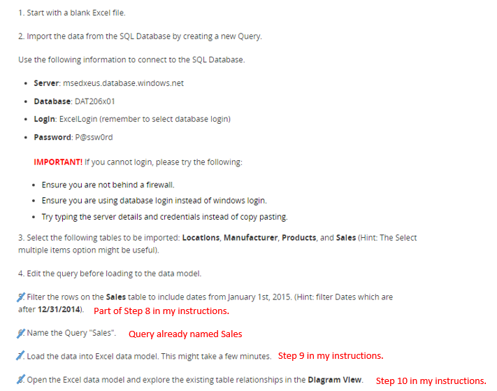

**\-Step 5-** From the Locations query we will create a CountryZip column by merging the Country and Zip columns. Click on the Country column in the Locations table and then while holding down the Ctrl key click on the Zip column. After you have both columns selected, select the Add Column tab on menu ribbon and click on the Merge Columns icon.

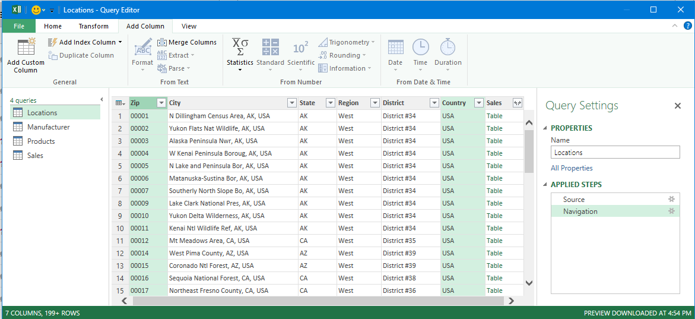

This will bring up the Merge Columns dialog box - you will not use any delimiters (spaces or special characters that would separate the two column items) so leave this setting alone. You will be changing the New Column Name from "Merged" to "CountryZip"

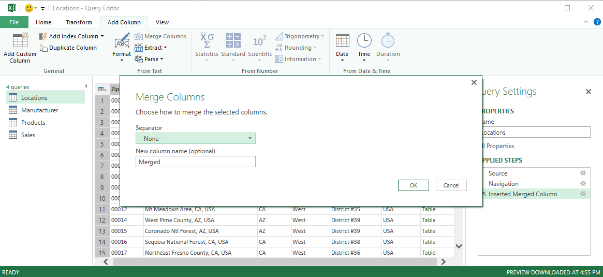

Type in the Name "CountryZip" in the New Column Name box and click on OK

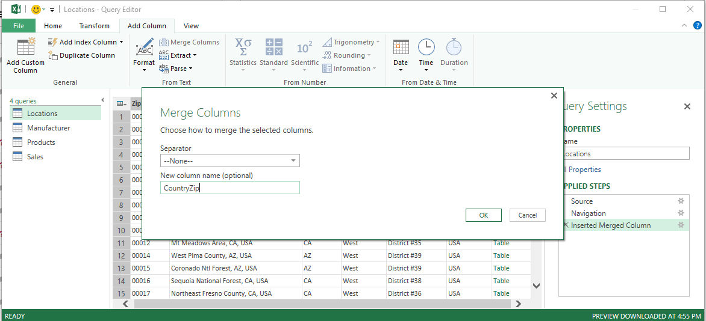

You should now see the added column to the right of the list of columns. You may also notice a column named "Sales" with all of the entries listed as "Table" - this is the power query automatic relationship detection working - it senses that the Locations and Sales tables may be related.

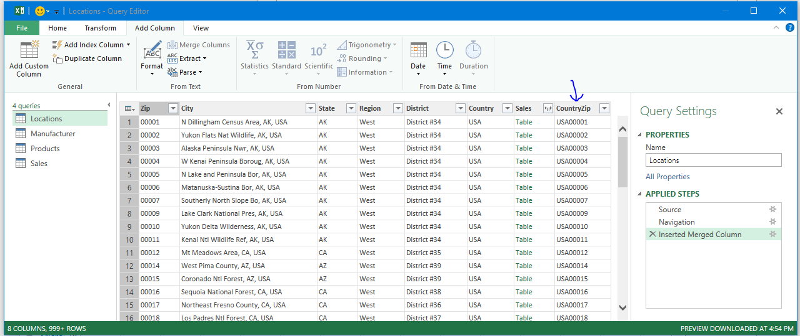

**\-Step 6-** Select the Manufacturer query (the list of queries should be shown in the far left of the window) and change the order of the two columns present.

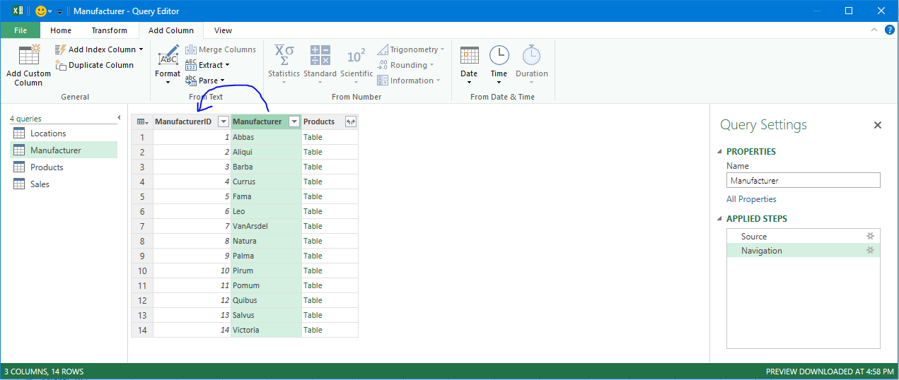

Click on the Manufacturer column and simply drag it to the left of the ManufacturerID column. You may also notice a column named "Products" with all of the entries listed as "Table" - again this is the power query automatic relationship detection working - it senses that the Manufacturer and Products tables may be related.

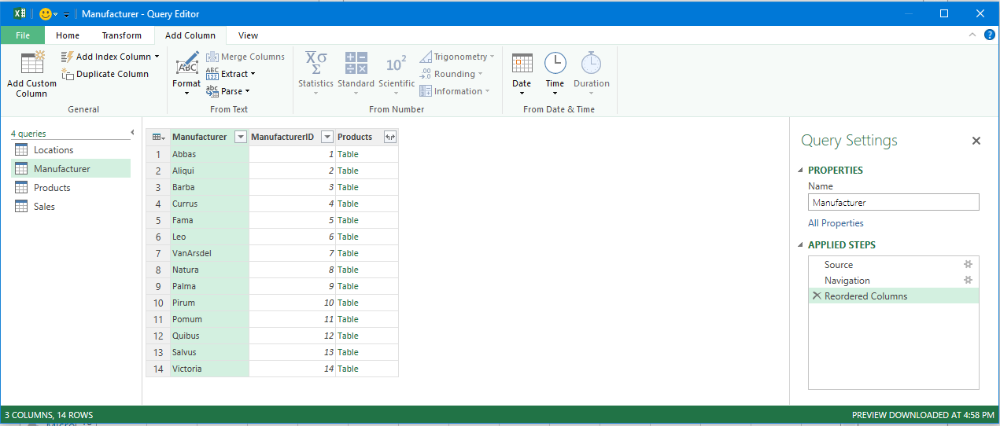

**\-Step 7-** Select the Products query and change the order of two of the columns - I chose to change the order of the Segment and Category columns.

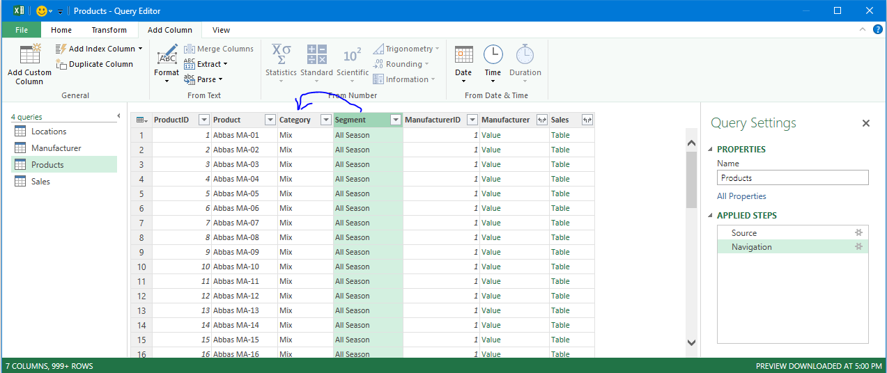

Click on the Segment column and simply drag it to the left of the Category column. You may also notice two extra columns one labeled "Manufacturer" with all entries listed as "Value" and another labeled "Sales" with all of the entries listed as "Table" - again this is the power query automatic relationship detection at work.

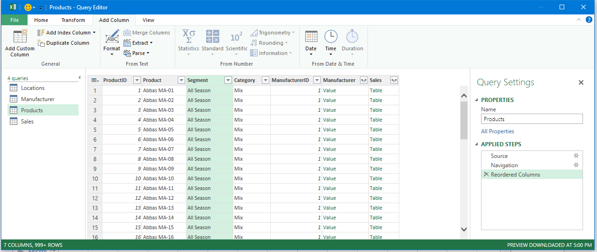

**\-Step 8-** Select the Sales query - I found through trial and error that I had to make several changes to this query to work. To start I created the CountryZip column by merging the Country and Zip columns. Click on the Country column in the Locations table and then while holding down the Ctrl key click on the Zip column. After you have both columns selected, select the Add Column tab on menu ribbon and click on the Merge Columns icon.

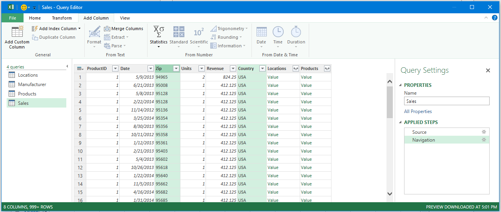

This will bring up the Merge Columns dialog box - again - you will not use any delimiters so leave this setting alone. You will be changing the New Column Name from "Merged" to "CountryZip"

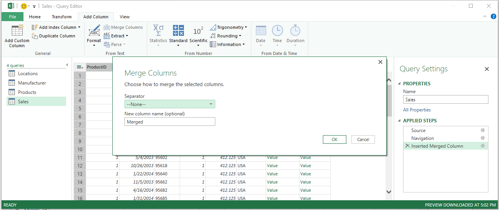

Type in the Name "CountryZip" in the New Column Name box and click on OK

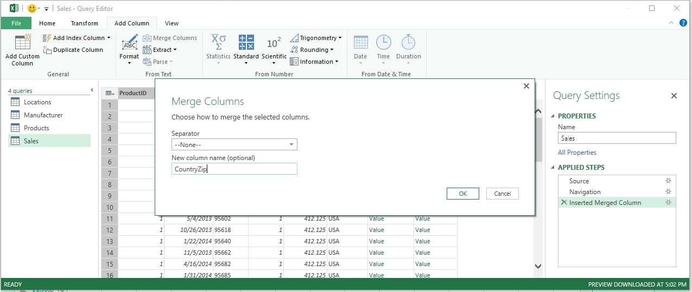

You should now see the added column to the right of the list of columns. You may also notice a two extra columns named "Locations" and "Products" both with all of the entries listed as "Table" - you should know what this is by now...

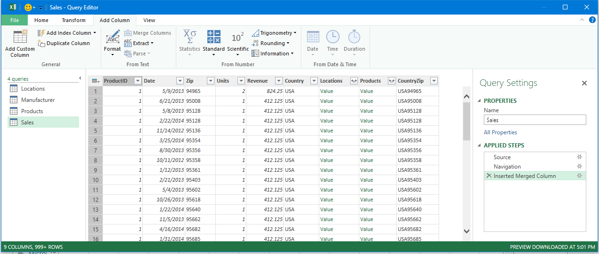

I have found that you also need to change the order of two columns... I decided to change the order of the Revenue and Units columns.

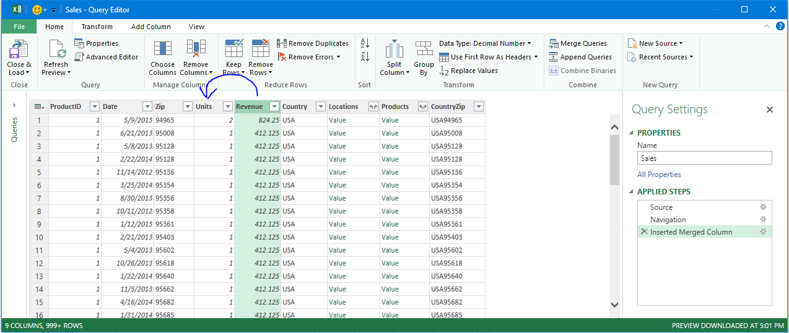

Click on the Revenue column and simply drag it to the left of the Units column.

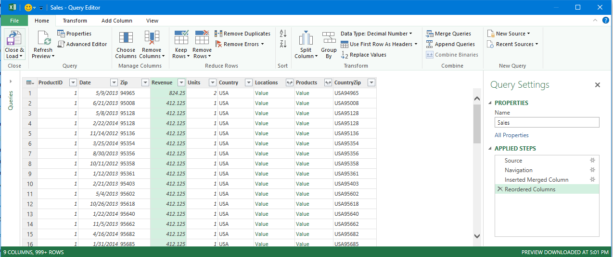

Finally, we will apply the Date filter to the Date column (AFTER 12/31/2014).

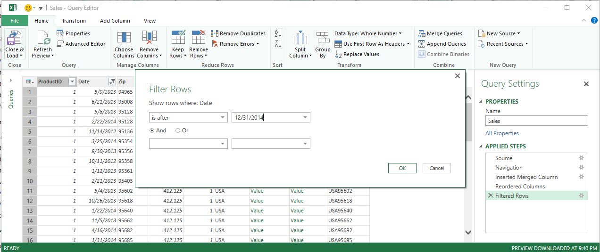

Notice all of the applied steps to the Sales query along the right hand side of the window.

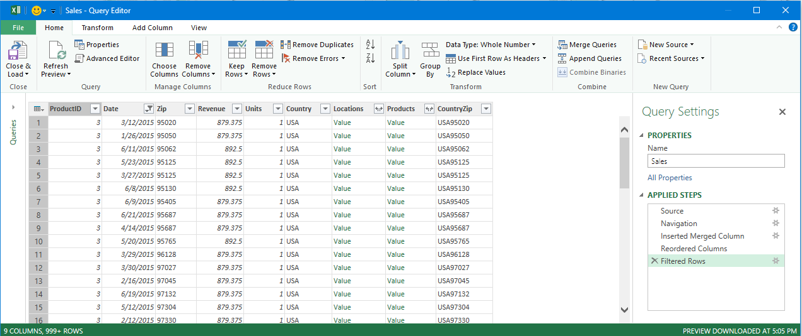

**\-Step 9-** From the File menu, select the **Close & Load To...** option.

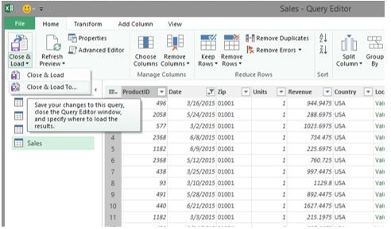

This will bring up the Load To Dialog box. Ensure you select the "Only Create Connection" option AND ensure you check the "Add this data to the Data Model" option. Then click on the Load button.

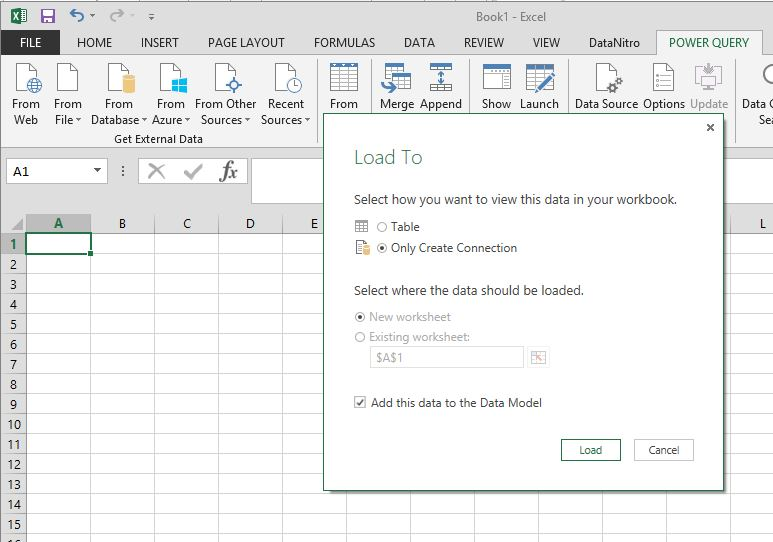

**\-Step 10-** Open the Excel data model and explore the existing table relationships in the **Diagram View.**

This should do it. If this set of instructions does not work for you, change things up. Change different things in each query (each table imported is a different query).

These instructions worked for me both from the "From Database" option and the "From Azure" option. If one isn't connecting, try the other one. There must be something in the air because they are being very finicky this course.

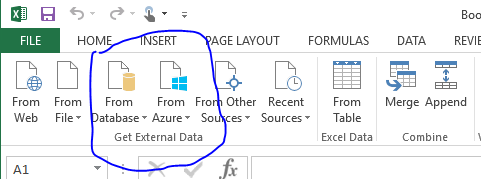

If by chance, after you load to the data model and the query takes you back to your Excel window you notice one or more of your queries has failed to load, simply edit that query to make another minor change and load again. In this example, my Locations query failed to load. Double click on the query in question which will bring you back to power query window.

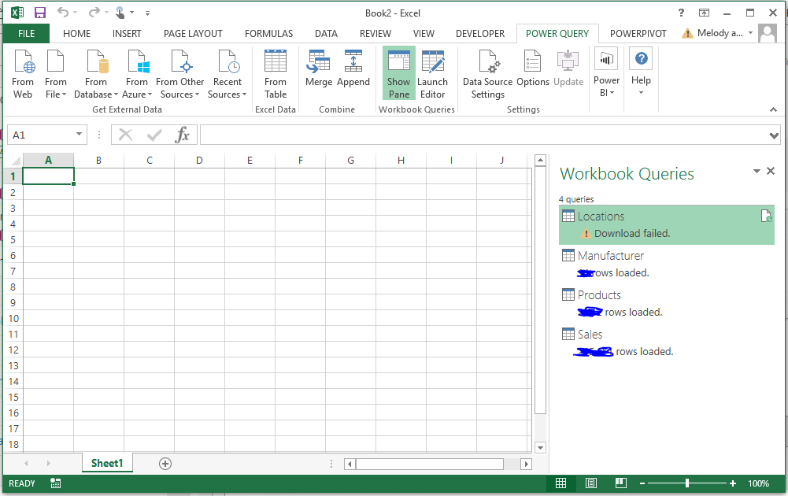

Simply change the order of one of the columns - in my case I'm changing the order of the Region and State columns.

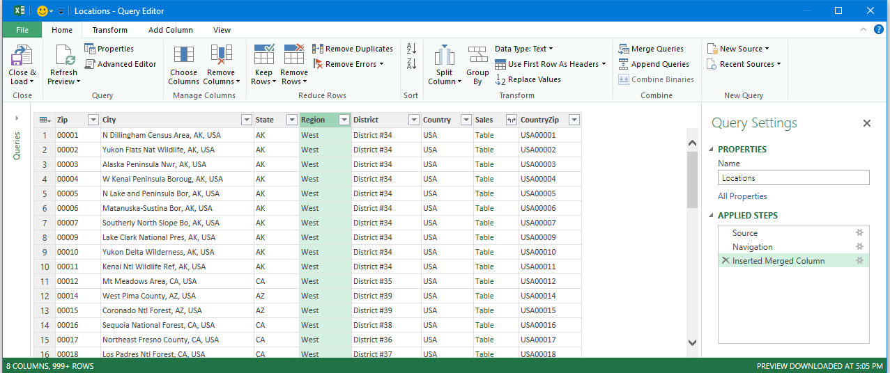

Click on the Region column and simply drag it to the left of the State column.

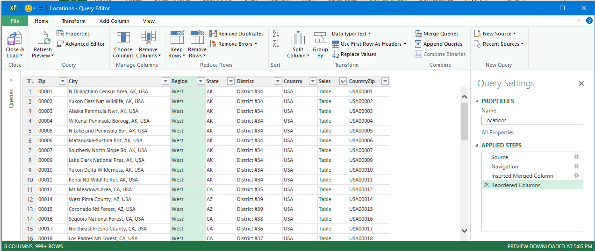

Click on the Close & Load icon (no need to choose the Close & Load To... option this time since you are only editing the query you already Loaded - but failed...). Continue doing this until you get all four tables successfully loaded.

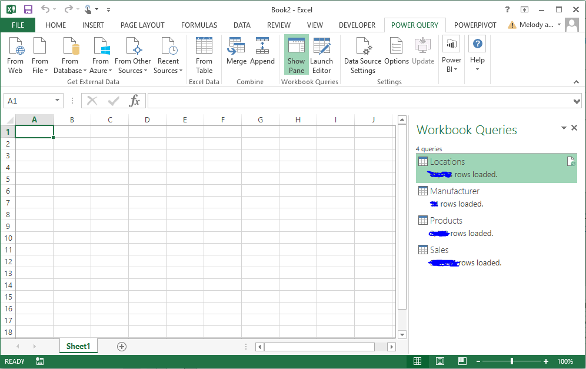

## Exercise 2: Import Data from a Folder Containing CSV Files

Continue with your Excel file from the previous exercise. You want to create a Query for the International sales and append the Query to the Query from US Sales.

IMPORTANT!!

- The CSV file used in this lab is created using the English - US locale, which means the decimal separator is a period and the thousands separator is a comma, and dates are formatted in m/dd/yyyy format. If you are using local settings like German, French, or others, in which the decimal separator is a comma and the thousands separator is a period, Power Query (or Query in Excel 2016) will ignore the period and treats all digits as numbers. You can change the locale of your Power Query for just the workbook you are using. If you use Excel 2010 or 2013, you can see the locale settings in the Power Query tab. If you are using Excel 2016, it is under New Query / Query settings / Data Load.
- You might be asked to confirm Privacy Levels when you append the International Sales query to the Sales query. You can read about privacy levels here. The article is talking about Power Query but the same apply to queries created by the get-and-transform functionality in Excel 2016. In short data can be public, organizational, or private and when the query mashes up different sources you may need to assign one of these privacy categories to each source so the query engine will know to send private data to a public source for a merge. If you assign Organizational to all the sources for the lab, you'll be fine.

**Lab Steps**

1. Download the zip file containing VanArsdel's international sales data and extract it to a folder. You should see 4 CSV files in the folder.
2. Import the data from the file folder by creating a new Query. To do this, use the From File / From Folder option and select the folder where you saved the 4 CSV files containing VanArsdel’s international sales data.
3. Perform the following steps:
    - Name the Query InternationalSales.
    - Filter out the records (rows) that come from the header of the CSV files. (Hint: Filter the Zip column where the row does not equal the text Zip. The filter is case sensitive so please type it in just as it appears here - Zip).
    - Filter the rows that are after 12/31/2014.
    - Create a CountryZip column by merging the Country and Zip columns.
4. Create the connection from the query without loading to the data model.
5. Edit the Sales Query from the previous exercise (SQL Database import).
6. Append the InternationalSales Query to the Sales Query.
7. Load the data into Excel data model. This might take a few minutes.
8. Ensure all other relationships are intact, otherwise, correct them accordingly.

### Lab Question

How many rows were imported from the Sales query now?

**232836**