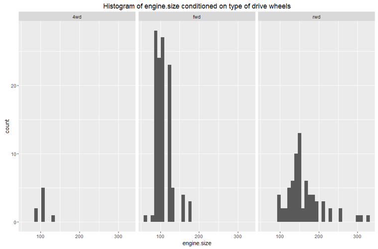
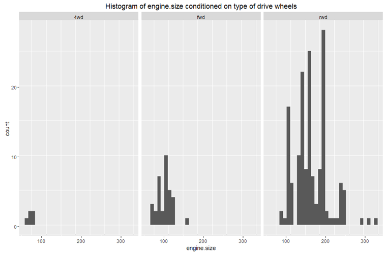
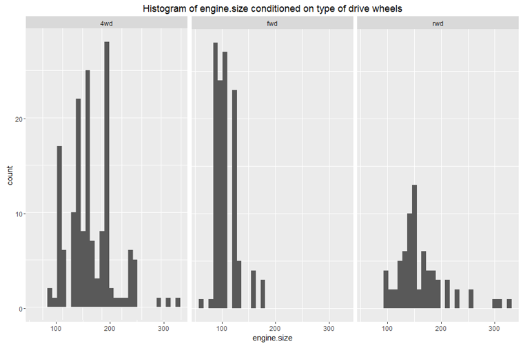
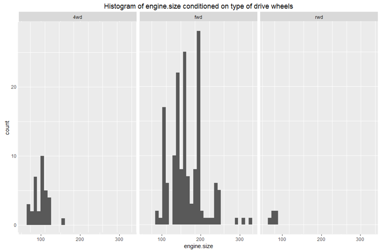

# Lab 4 - Quiz

### Plotting Automobile Data

Which of the following conditioned histograms most closely resembles the distribution of engine size conditioned on drive wheels?

- **Histogram A**
- Histogram B
- Histogram C
- Histogram D

### Plotting Adult Income

Based on the conditioned box plots you created for the adult income classification dataset, the median age of adults who earn $50K or less is...

**Lower than the median age of adults who earn more than $50K**