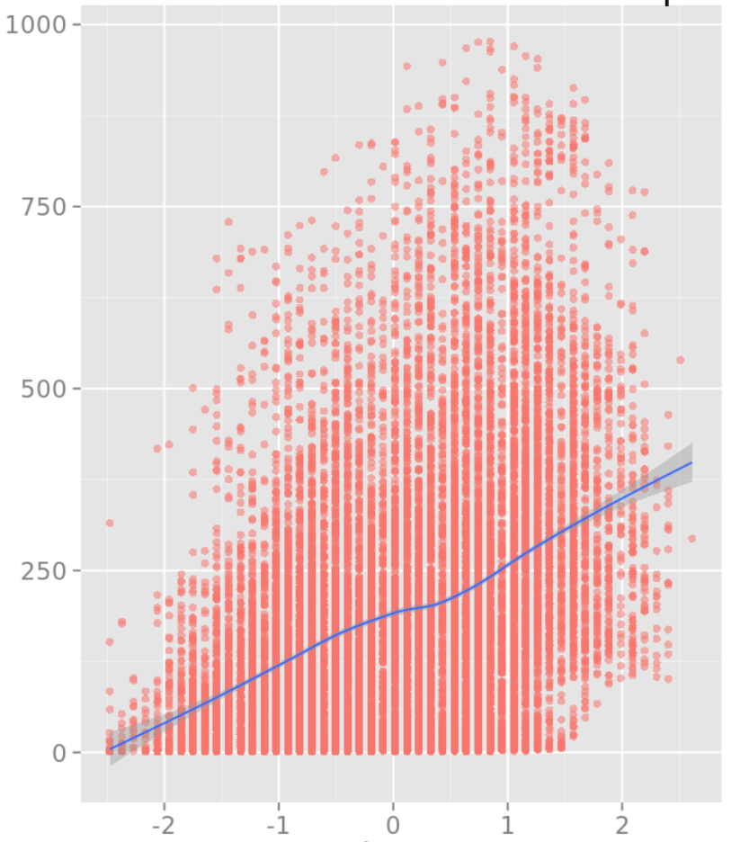
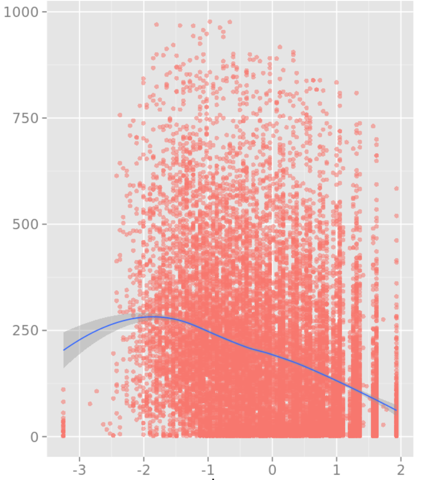
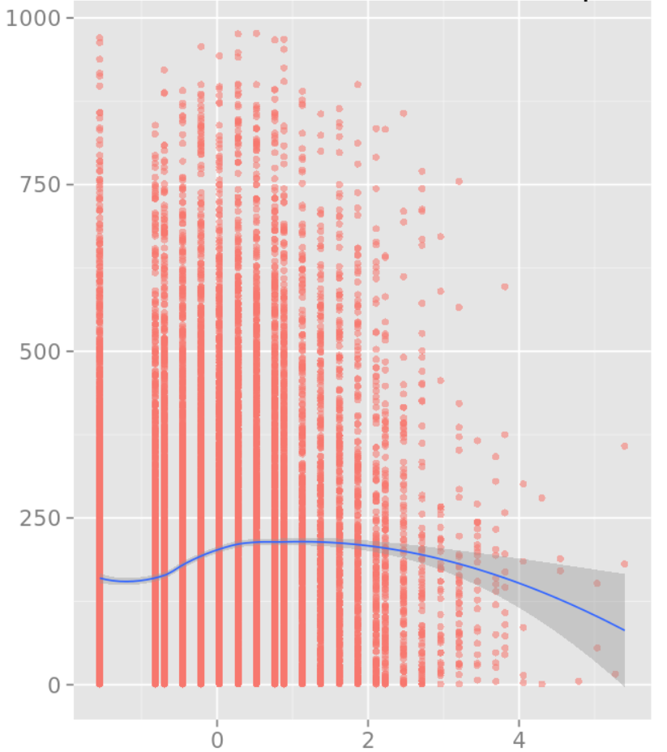

# Lab 2 - Quiz

### Data Visualization

In the lab, after preparing the data you used R or Python to visualize it.

Which of the following plots shows bike rentals vs hr?

- Plot A
- Plot B
- Plot C
- **Plot D**

### Model Evaluation

In the lab, you used the Evaluate Model module to evaluate your regression model.

Which of the following is closest to the Relative Squared Error for your model?

- 0.243
- **0.618**
- 0.825
- 1.0