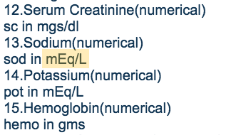

# Lab 3 - PCA

### Lab Assignment 1

In this assignment, you're going to experiment with a real life armadillo sculpture scanned using a Cyberware 3030 MS 3D scanner at Stanford University. The sculpture is available as part of their 3D Scanning Repository, and is a very dense 3D mesh consisting of 172974 vertices! The mesh is available for you, located at /Module4/Datasets/stanford_armadillo.ply. It is not a Python file, so don't attempt to load it with a text editor!


Open up the Module4/assignment1.py starter code and read through it carefully. You will notice the use of a new library, Plyfile. This library loads up the 3D binary mesh for you. The mesh is further converted into a Pandas dataframe for your ease of manipulation. Complete the following tasks:

1. Before changing any of the code, go ahead and execute assignment1.py. You should see the 3D armadillo. Your goal is to reduce its dimensionality from three to two using PCA to cast a shadow of the data onto its two most important principal components. Then render the resulting 2D scatter plot.
2. Fill out the proper code in the do_PCA() and do_RandomizedPCA() methods. Be sure to return the result of your transformation! You may even want to read the SciKit-Learn documentation on .transform(), just for future reference so you know what data type comes out of it.
4. Re-run the application! Then, answer the questions below:

### Lab Question 1

The first time you see the armadillo in 3D, what direction was its face pointing towards?

- **Left, Towards the negative X-Axis**
- Up, Towards the positive Z-Axis
- Right, Towards the positive X-Axis
- Down, Towards the negative Z-Axis

### Lab Question 2

Were you able to discern any visual differences between the transformed PCA results and the transformed RandomizedPCA results?

- Yes, the RandomizedPCA version was no longer even recognizable as an armadillo
- Yes, the RandomizedPCA version was a lot less true to the original than the regular PCA version
- Yes, but it wasn't a lot... just minor differences
- **No, they pretty much looked the same to me**

Which executed faster, RandomizedPCA or PCA?

- PCA
- **RandomizedPCA**

## Lab Assignment 2

In Lab Assignment 1, you applied PCA to a dataset generated by 3D-scanning an actual sculpture. Real life 3D objects are a good segue to PCA, since it's fun to see its effects on a dataset we can see and touch. Another benefit is that all three spatial dimensions, x, y, and z, each measure the same unit-length relative to one another, so no extra consideration need be made to account for PCA's weakness of requiring feature scaling.

But now the fun is over. Gaining some practical experience with real-world datasets, which rarely allot you the luxury of having features all on the same scale, will help you see how critical feature scaling is to PCA. In this lab, you're going to experiment with a subset of UCI's Chronic Kidney Disease data set, a collection of samples taken from patients in India over a two month period, some of whom were in the early stages of the disease. The starter code over at /Module4/assignment2.py.

1. Start by looking through the attribute information on the dataset website. Whenever you're given a dataset, the first thing you should do is find out as much about it as possible, both by reading up on any metadata, as well as by prodding through the actual data. Particularly, pay attention to what the docs say about these three variables: bgr, rc, and wc.
2. Load up the kidney_disease.csv dataset from the /Module4/Datasets/ directory, and drop all rows that have any nans. You're probably already a pro at doing that by now. In addition to getting rid of nans, did you know that the .dropna() method (upon completion) also automatically re-checks your features and assigns them an appropriate inferred data types?
3. Use an appropriate indexer command to select only the following columns: bgr, rc, and wc. Or alternatively, you can drop every other column, but it's probably easier to just use an indexer to select the one's you wish to keep.
4. Do a check of your dataframe's dtypes. Anything that didn't make it to the right type, you may want to investigate. Look through the data and identify why the conversion failed. These types of problems often arise when you aren't in control of how your data is organized. Luckily the issue isn't too bad so once you've identified it, you can fix it through simple numeric coercion.
5. Print the variance of your dataset, as well as a .describe() printout.
6. Reduce your dataset to two principal components by running it through PCA, then check out the resulting visualization.

### Lab Question 1



Having reviewed the dataset metadata on its website, what are the units of the wc, White Blood Cell Count feature? An example of where units are defined is shown above. NOTE: In case the UCI site is down, here is a mirror.

- mm/Hg
- mgs/dl
- mEq/L
- **cells/cumm**
- gms

### Lab Question 2

Why did the .dropna() method fail to convert all of the columns to an appropriate numeric format?

- It actually did successfully convert them
- There were a few erroneous leading tab / whitespace characters
- There were a few erroneous trailing tab / whitespace characters
- The dataset comma offset was incorrect in a few rows causing nans to move into the next column

Sort the features below from the largest to the smallest variance amount.

**wc,brg,rc**

### Lab Question 3

As you know, the first thing PCA does is center your dataset about its mean by subtracting the mean from each sample. Looking at the .describe() output of your dataset, particularly the min, max, and mean readings per feature, which feature do you think dominates your X axis? How about the Y axis?

- **wc dominates the X axis, and bgr dominates the Y axis**
- wc dominates the X axis, and rc dominates the Y axis
- rc dominates the X axis, and bgr dominates the Y axis
- bgr dominates the X axis, and wc dominates the Y axis

According to your labeling, red plots correspond to chronic kidney disease, and green plots are non-CKD patients. Looking at the scatter plot, are the two classes completely separable, or are there multiple records mixed together?

**No, a few records are mixed together**

You're almost there! The last thing you have to do, and the purpose of this lab really, is to see how feature scaling alters your PCA results.

1. Make a backup of your assignment2.py file for safe keeping.
2. Change the line that reads:

    ```scaleFeatures = False```

    So that is now reads:

    ```scaleFeatures = True```

3. Also take a look inside of assignment2_helper.py. There are some important notes in there about what SKLearn's *transform() methods do, and why they do it. You will need to know this information for future labs!
4. Re-run your assignment and then answer the questions below:

### Lab Questions (Continued)

Did scaling your features affect their variances at all?

- **Yes**
- No

After scaling your features, are the green patients without chronic kidney disease more cleanly separable from the red patients with chronic kidney disease?

- They are less separable
- There isn't much change
- **They are more separable**

## Lab Assignment 3

You're not quite done with chronic kidney disease yet—we still need to beat it! In the previous lab assignment, you focused only on three features out of the entire dataset: bgr, rc, and wc. That should have seemed strange to you. How did we know to direct your attention only to those features? The answer, of course, is through PCA. By running PCA on the raw dataset data, we were able to find suitable candidate features to show the importance of feature scaling. For this lab, there will be no starter code. Copy your finished Lab 2, assignment2.py file over as assignment3.py and start working from that.

1. Head back over to the dataset page (or you can look at the kidney_disease.names file in your /Module4/Datasets/ directory). Each column has a type listed, e.g. numeric, nominal, etc. Here is a formatted list of the nominal features for your copy and pasting pleasure:

    ['id', 'classification', 'rbc', 'pc', 'pcc', 'ba', 'htn', 'dm', 'cad', 'appet', 'pe', 'ane']

    Instead of using an indexer to select just the bgr, rc, and wc, alter your assignment code to drop all the nominal features listed above. Be sure you select the right axis for columns and not rows, otherwise Pandas will complain!

2. Right after you print out your dataset's dtypes, add an exit() so you can inspect the results. Does everything look like it should / properly numeric? If not, make code changes to coerce the remaining column(s).
3. Run your assignment and then answer the questions below.
4. Alter your code so that you only drop the id and classification columns. If you loaded your dataset properly, you won't have to drop the id column, because it wouldn't have been included as a feature. For the remaining 10 nominal features, properly encode them by as explained in the Feature Representation section by creating new, boolean columns using Pandas .get_dummies(). You should be able to carry that out with a single line of code. Run your assignment again and see if your results have changed at all.

Important Notes:

Once you've completed this lab, be sure to drop by the Dive Deeper section and read the article on using PCA on boolean features! Also, it's important to keep in mind that PCA is an unsupervised learning technique. It neither knows or even cares about your data's labels and classifications. In the previous two labs, you used a pre-labeled dataset only to see how applying PCA transformations can effect other machine learning modeling process further down the analysis pipeline.

### Lab Questions

After adding in all of numeric columns, do the green, non-chronic kidney disease patients group closer together than before?

**Yes**

After converting the nominal features to boolean features, do the green, non-chronic kidney disease patients group even closer together than before?

**Yes**