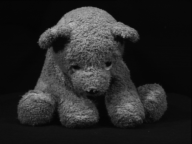

# Lab 4  - Isomap

## Lab Assignment 4

After having a brief conversation with Joshua Tenenbaum, the primary creator of the isometric feature mapping algorithm, it only seems right that we make your first lab assignment be replicating his canonical, dimensionality reduction research experiment for visual perception! In fact, you will also be using his original dataset (cached website, cached dataset) from December 2000. It consists of 698 samples of 4096-dimensional vectors. These vectors are the coded brightness values of 64x64-pixel heads that have been rendered facing various directions and lighted from many angles. Replicate Dr. Tenenbaum's experiment by:

1. Applying both PCA and Isomap to the 698 raw images to derive 2D principal components and a 2D embedding of the data's intrinsic geometric structure.
2. Project both onto a 2D scatter plot, with a few superimposed face images on the associated samples.
3. Extra: If you're feeling fancy, increase n_components to three, and plot your scatter plot on a 3D chart.

NOTE: If you encounter issues with loading .mat files using SciPy, you might want to see this Stack Overflow post and check the version of SciPy you're using.

### Lab Questions

Between linear PCA and the non-linear Isomap, which algorithm is better able to capture the true nature of the faces dataset when reduced to two component?

- PCA
- **IsoMap**

Each coordinate axis of your 3D manifold should correlate highly with one degree of freedom from the original, underlying data. In the isomap plot of the first two components (0 and 1), which 'degree of freedom' do you think was encoded onto first component (the X-axis) encoded? In other words, what varies as you move horizontally in your manifold rendering?

**Left and Right Head Position**

Alter your code to graph the second and third components (index=1 and 2) instead of the 0th and 1st, for both PCA and Isomap. Look *closely* at the Isomap plot. Can you tell what 'degree of freedom' the X axis represents?

**Down and Up Head Position**

In his experiment, Dr. Tenenbaum set his K-parameter (n_neighbors is SciKit-Learn) to 8. Try reducing that figure down to 3 and re-running your code. Does the X-Axis still represent the same degree of freedom?

**Yes**

## Lab Assignment 5

Now that you've had your first taste of isomap, let's take your knowledge of it to the next level.

Whatever your high-dimensional samples are, be they images, sound files, or thoughtfully collected attributes, they can all be considered single points in a high dimensional feature-space. Each one of your observations is just a single point. Even with a high dimensionality, it's possible that most or all your samples actually lie on a lower dimension surface. Isomap aims to capture that embedding, which is essentially the motion in the underlying, non-linear degrees of freedom.

By testing isomap on a carefully constructed dataset, you will be able to visually confirm its effectiveness, and gain a deeper understanding of how and why each parameter acts the way it does. The ALOI, Amsterdam Library of Object Images, hosts a huge collection of 1000 small objects that were photographed in such a controlled environment, by systematically varying the viewing angle, illumination angle, and illumination color for each object separately. To really drive home how well isomap does what it claims, this lab will make use of two image sets taken from the ALOI's collection.

 

Manifold extraction, and isomap specifically are really good with vision recognition problems, speech problems, and many other real-world tasks, such as identifying similar objects, or objects that have undergone some change. In the case of the 3D rotating object such as the office chair example from earlier, if every pixel is a feature, at the end of the day, the manifold surface is parametrizable by just the angle of the chair—a single feature!

1. Start by having a look through the Module4/Datasets/ALOI/ directory. There are two directories filled with 192 x 144 pixel images. Identify their ordering and try to figure out what's changing between the images. They might not be perfectly ordered, but that doesn't matter to isomap.
2. Create a regular Python list object. Then, write a for-loop that iterates over the images in the Module4/Datasets/ALOI/32/ folder, appending each of them to your list. Each .PNG image should first be loaded into a temporary NDArray, just as shown in the Feature Representation reading.

    Optional: Resample your images down by a factor of two if you have a slower computer. You can also convert the image from  0-255  to  0.0-1.0  if you'd like, but that will have no effect on the algorithm's results.
3. Convert the list to a dataframe and run isomap on it to compute the lower dimensional embedding. Be sure to set n_components to 3 so you can visualize your manifold. You can also set the neighborhood size to six.
4. Plot the first two manifold components using a 2D scatter plot, then plot the first three components using a 3D scatter plot. Run your assignment and then answer the questions below.

### Lab Questions

Please describe the results of your isomap embedding--either the 3D or 2D one, it doesn't matter:

- It is completely sporadic. It's hard to detect the pattern at this point, since we discarded too many dimensions
- **The embedding appears to follow an easily traversable, 3D spline**
- It looks like a geometric pattern, but we probably need to increase the neighborhood resolution before a discernible shape emerges
- Isomap rendered the result as a straight line, as expected, since only a single degree of freedom is altered in the images

Try reducing the 'n_neighbors' parameter one value at a time. Keep re-running your assignment until the results look visible different. What is the smallest neighborhood size you can have, while maintaining similar manifold embedding results?

**2**

Almost done! Two more steps to complete this lab:

1. Once you're done answering the first three questions, right before you converted your list to a dataframe, add in additional code which also appends to your list the images in the Module4/Datasets/ALOI/32_i directory.
2. Create a colors Python list. Store a 'b' in it for each element you load from the /32/ directory, and an 'r' for each element you load from the '32_i' directory. Then pass this variable to your 2D and 3D scatter plots, as an optional parameter c=colors. Re-run your assignment and answer the final question below.

### Lab Questions (Continued)

Reset your 'n_neighbors' if you changed it from 6. After adding in the additional images from the 32_i dataset, do examine your 2D and 3D scatter plots again. Have the new samples altered the shape of your original (blue) manifold?

- No, not in the slightest
- **Only very slightly...**
- It looks like a completely different shape

 What is the arrangement of the newly added, red samples?

- **Isomap rendered the result as a straight line, intersecting the original manifold**
- They are completely sporadic compared to the original manifold, so no real pattern exist
- They are aligned in a smaller circle, intersecting the original manifold