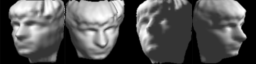

# lab 6 - K-Nearest Neighbors

## Lab Assignment 5

Remember that wheat dataset you used while exploring visualizations? It's about to make a comeback! While learning the many classification algorithms we're going to cover in the next few sections, it's a good idea to have a 'benchmark dataset' to come back to, so you can can compare the performance and accuracy of other algorithms.

1. Start by looking through the starter code /Module5/assignment5.py and /Module1/Datasets/wheat.data
2. Complete the assignment except for the bonus instruction.
3. Try experimenting with other feature scaling methods, in addition to normalize(), to see how they affect the decision boundary.
4. Then, answer the following questions.

### Lab Questions 1

Please enter a numeric value (e.g. 0, 1, 10.5, etc) which correctly answers the question(s) below:

What is the accuracy score of your KNeighbors Classifier when K=9 (Enter as a decimal)?

**0.871428571429**

### Lab Questions 2

Decrease K by 1 and record the new accuracy score. Keep doing this until you get down to, and including, K=1. Concerning the scores you saw:

**I got the same reading again, but overfit my data**

## Lab Assignment 6

In this assignment, you'll flex your understanding of Isomap and KNeighbors, as well as practice splitting your data for testing and evaluation by taking your Module4/assignment4.py lab to the next level. If you haven't been able to complete module four's labs or haven't fully understood them, take a moment to re-do them all before proceeding.

This assignment was engineered to be truer to the life of a data scientist by being more challenging than previous ones, so do not be disheartened. If data explorers only needed to drop their observations into black-box algorithms without investing time to toggle parameters, and experiment and understand what those algorithms were truly doing to their data, they wouldn't be valued as much.

In module four's fourth lab assignment, you explored using isomap, an indispensable tool to have while working with non-linear datasets. Your goal this time is to train the KNeighborsClassifier to identify what direction a face is pointing towards: either up, down, left, or right.

This data takes the form of image samples that have been transformed either using PCA to reduce their linear dimensionality, or isomap to non-linearly do similar. Start by reviewing your lab work in the Module4/assignment4.py file before opening up the /Module5/assignment6.py starter code. You will need access to the face_data.mat file from Module four, as well as the new Module5/face_labels.csv file.

1. Add in the Module4/assignment4.py code responsible for: loading up the .mat file, properly rotating its images, and storing the whole thing into a Pandas dataframe object.
2. Load into a dataframe your classifications faces_labels.csv file. Make sure your dataframe and your .csv file align properly and start from the same values! This classification dataframe only has a single column in it, so create a series (a slice) that selects only that column and save it as label.
3. Do your train_test_split just as directed in the reading. Set random_state=7 as documented. Your variables should be: data_train, data_test, label_train, and label_test.
4. Fill out the code for PCA, Isomap, and KNeighborsClassifier. Both PCA and Isomap should be reducing your training data's dimensionality down to 2D. You're free to experiment with different K values for KNeighborsClassifier.
5. Predict the accuracy of the test dataset / test label using .score() and print it out.
6. Answer the questions below:

### Lab Question 1

Please enter a numeric value (e.g. 0, 1, 10.5, etc) that correctly answers the question(s) below:

Enter the accuracy value reported for your KNeighbor's model, after doing a test/train split (test_size = 15%, random_state = 7) and using ISOMAP (5Neighbors, 2Components) to transform your data:

**0.961904761905**

### Lab Question 2

Only one of the following setups is ideal if you plan on using SciKit-Learn's KNeighbors classifier to predict the label of your samples after transforming them. Which is it?

- **Fit and transform your data using PCA or Isomap. Split your data. Then fit the KNeighbors model against the training data and labels. Then predict the class of your testing data.**
- Use preprocessing to scale your training and testing data. Split your data. Fit and transform your training data using PCA or Isomap, and fit the KNeighbors model against the training data and labels. Then predict the class of your testing data.
- Use preprocessing to scale your training and testing data. Split your data. Fit and transform your testing data using PCA or Isomap, and fit the KNeighbors model against the training data and labels. Then predict the class of your testing data.
- Fit and transform your data using PCA or Isomap. Then fit the KNeighbors model against your data and labels. Then split your data and predict the class of your testing data.

## Lab Assignment 7

Breast cancer usually starts from an uncontrolled growth of the cells that make up the milk-producing ducts. While fairly uncommon with men (less than 0.1% experience it), according to BreastCancer.org, one in eight women (12%) end up developing a malignant form of breast cancer over the course of their lifetime. These invasive cells form tumors that destroy nearby tissue, can spread to other parts of the body, and if not duly addressed, may result in death. To put things into perspective, in the U.S., roughly 600 women die per year due to pregnancy related complications... yet over 40,000 die per year due to breast cancer.

Breast cancer doesn't develop over night and, like any other cancer, can be treated extremely effectively if detected in its earlier stages. Part of the understanding cancer is knowing that not all irregular cell growths are malignant; some are benign, or non-dangerous, non-cancerous growths. A benign tumor does not mean the mass doesn't increase in size, but only means it does not pose a threat to nearby tissue, nor is it likely to spread to other parts of the body. The mass simply stays wherever it's growing. Benign tumors are actually pretty popular, such as moles and some warts. Being able to properly assess if a tumor is actually benign and ignorable, or malignant and alarming is therefore of importance, and also is a problem that might be solvable through data and machine learning.

In this lab, you'll be using the Breast Cancer Wisconsin Original  data set, provided courtesy of UCI's Machine Learning Repository. A copy of the dataset is located at Module5/Datasets/breast-cancer-wisconsin.data. Here are the column names, which you can read more details about on the dataset's information page: ['sample', 'thickness', 'size', 'shape', 'adhesion', 'epithelial', 'nuclei', 'chromatin', 'nucleoli', 'mitoses', 'status'].

1. Open up the starter code located in Module5/assignment7.py, and as usual, read through it entirely.
2. Load up and clean up the dataset, and follow the written directions to split your data, do feature scaling since the features use different units, and then implement PCA and IsoMap so you can test the performance of both, as the technique used to reduce the dimensionality of the dataset down to two variables.
3. Train KNeighborsClassifier on the 2D projected training dataset, the score KNeighborsClassifier on the 2D projected testing dataset.
4. Finally, plot the decision boundary for visual confirmation.

### Lab Question 1

Code up everything as instructed in the assignment. Experiment with various SKLearn preprocessing scaler classes, such as: MaxAbsScaler(), MinMaxScaler(), StandardScaler(), Normalizer(), RobustScaler(), and of course no scaling at all.

Overall, which produced the best result (highest accuracy when scoring against testing data)?

- Normalizer()
- **MinMaxScaler()**
- RobustScaler()
- StandardScaler()

### Lab Question 2

It's important to always keep the objective of the problem you're solving in mind. In this case, your goal is to come up with a way to classify tumor growths as benign or malignant, based off of a handful of features. This is so that a simple test can be administered to see if further action need be taken when a tumor is discovered.

There are two types of errors this classification can make, and they are NOT equal. The first is a false positive. This would be the algorithm errantly classifying a benigh tumor as malignant, which would then prompt doctors to investigate it further, perhaps even schedule a surgery to have it removed. It would be wasteful monetairly and in terms of resources, but not much more than that.

The other type of error would be a false negative. This would be the algorithm incorrectly classifying a dangerious, malignant tumor as benign. If that were to occur, the tumor would be given time to progress into later, more serious stages, and could potentially spread to other parts of the body. A much more dangerious situation to be in.

The KNeighbors classifier in SciKit-Learn gives you the ability to specify weights when initializing the object. By default, these weights are set to 'uniform', so every "K" neighbor has an even vote. It also allows you to specify 'distance', where the votes are scaled inversely porportionally to their distance from the sample being classified (1/d). Lastly, it allows you to specify a user defineable function.

The problem is, the UDF takes in as parameters only a vector of distances and expects an equally sized vector of weights. This doesn't allow you to take advantage of using a different metric on a per class basis to properly weigh your samples to address the undesireability of false negatives over false positives, as it's WAY more important to errantly classify a benign tumor as malignant and have it removed, than to incorrectly leave a malignant tumor, believing it to be benign, and then having the patient progress to full blown in cancer.

One work around for this would be to program your own KNeighbors classifier. Another would be to "bake" the information into your dataset by taking advantage of the fact that KNeighbors is sensitive to the distribution of your variables. For example, randomly reducing the ratio of benign samples compared to malignant samples in your training set.

Between the two provided SciKit-Learn options for weighing, which one performed better on this dataset overall, given the many 'K' permutations you experimented with?

- Uniform, because each data point should contribute to the classification equally
- Uniform, because the dataset has an instrinsic clustering of sample values
- **Distance, because each data point should contribute to the classification weighted by distance**
- Distance, because this dataset only has a few samples, so weighing nearer samples is very important