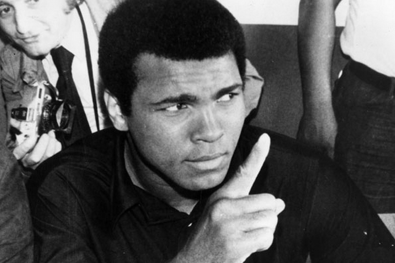

# Lab 8 - SVC

## Lab Assignment 1

In this lab, you'll get started with support vector classifier by revisiting UCI's wheat-seeds dataset. First, you will benchmark how long it takes to train and predict with SVC relative to how long K-Neighbors took to train and test, and then you'll compare the decision boundary plot produced by the two.

1. Start by reviewing the starter code located in Module6/assignment1.py and of course the wheat dataset in Module6/Datasets/wheat.data. Be sure to read through everything, so that you know exactly what is being asked of you...
2. Add in the KNN and SVC classifiers
3. Load up your dataset properly and prune it
4. Run the convenience benchmark and plotting functions
5. Then, answer the following questions.

### Lab Question 1

In this lab, you run KNeighbors and SVC in high dimensional feature space, 5000 times! Ensure you don't have any spyware, movies, games, video editing, or other hardware intensive apps running while you execute the timed runs.

After the high dimensional classification and benchmarking finishes, the lab plots for you a matrix of 2D, feature vs feature plots against one another. This way, you can see how each pair of features stack against the other. Since a square matrix is produced, there are two copies of each plot, although the axes are swapped, and that is controllable by the FAST_DRAW parameter.

Which of the four tests produced the highest scoring result?

- KNeighbors High Dimensionality Score
- KNeighbors "Best" 2D Score
- SVC High Dimensionality Score
- **SVC "Best" 2D Score**

### Lab Question 2

Change iterations from 5000 to 200,000 and then re-run your lab with the default parameters.

Ensure you don't have anything else processor intensive running on your machine for the duration of time it takes to do its number crunching (should be 1-10 minutes on modern laptops).

Which of these four computations was *fastest* to calculate?

- KNeighbors Training Time
- KNeighbors Testing Time
- SVC Training Time
- **SVC Testing Time**

## Lab Assignment 2

"Is that a 1 or a 7?"

Even though the United States Postal Service, as an organization, was formed in 1971, it traces its roots back to the Post Office Department, an organization formed in 1792 by Benjamin Franklin. It later evolved into a cabinet-level department in 1872, before finally being transformed into the USPS we know today in 1971, as an agency of the U.S. government.

Back in the day, all mail was hand read and delivered. Even up the turn of the 20th century, antiquated techniques such as the pigeonhole method from colonial times were used for mail-handling. During the 1950's, the post office started intense research on the coding systems used in many other countries and started down the process of automation. In 1982, the first computer-driven, OCR machine got installed in Los Angeles, and by the end of 1984, over 250 OCRs machines were installed in 118 major mail processing centers across the country and were processing an average of 6,200 pieces of mail per hour.


Nowadays, the Postal Service is one of the world leaders in optical character recognition technology with machines reading nearly +98 percent of all hand-addressed letter mail and +99.5 percent of machine-printed mail, with a single tray sorting machines capable of sorting more than 18 million trays of mail per day.

Let's see if it's possible for you to train a support vector classifier on your computer in a few seconds using machine learning, and if your classification accuracy is similar or better than the advertised USPS stats. For this lab, you'll be making use of the Optical Recognition of Handwritten Digits dataset, provided courtesy of UCI's Machine Learning Repository.

1. Fully review the starter code stored in Module6/assignment2.py. If you have any questions about it, please ask them on the forum before you submit your lab answers. The dataset for the lab is stored at /Module6/Datasets/optdigits.tes and /Module6/Datasets/optdigits.tra. Check out the official dataset page at the UCI ML Repository to figure out why there are two files.
2. Make the requisite changes to get the project running, by providing the path to the .tes and .tra files.
3. Train your SVC classifier with the parameters provided, and keep testing until you're able to beat the classification abilities of the USPS.
4. Remember how important having a lot of samples is for machine learning? Try tossing out 96% of your samples, and see how it affects the accuracy of your highest accuracy support vector classifier.
5. Answer the questions below.

### Lab Question

In this lab, you must complete a series of steps in order to beat the USPS high score for accuracy. What was your accuracy score, as displayed by your assignment, when you first beat the USPS?

**0.982739420935**

If you're up for a challenge, check out another handwritten digits datasets, such as The MNIST Database of handwritten digits, and Handwritten Digit Recognition to see how good you can get your classifier to perform on them.

If you need source code to load MNIST - formatted data, such as from the above two links, use the code below:

```
def load(path_img, path_lbl):
  from array import array
  import struct

  with open(path_lbl, 'rb') as file:
    magic, size = struct.unpack(">II", file.read(8))
    if magic != 2049:
      raise ValueError('Magic number mismatch, expected 2049, got {0}'.format(magic))
    labels = array("B", file.read())

  with open(path_img, 'rb') as file:
    magic, size, rows, cols = struct.unpack(">IIII", file.read(16))
    if magic != 2051:
      raise ValueError('Magic number mismatch, expected 2051, got {0}'.format(magic))
    image_data = array("B", file.read())

  images = []
  for i in range(size): images.append([0] * rows * cols)
  for i in range(size): images[i] = np.array(image_data[i * rows * cols:(i + 1) * rows * cols]).reshape(28,28)[::divisor,::divisor].reshape(-1)
  return pd.DataFrame(images), pd.Series(labels)


X, y = load('digits.data', 'digits.labels')
```

You can set divisor to any int, e.g. 1, 2, 3. If you set it to 1, there will be no resampling of the image. If you set it to two or higher, the image will be resamples by that factor of pixels. This, in turn, speeds up training but may reduce overall accuracy.

## Lab Assignment 3

Growing up, everyone has a hero. For many people, that hero was Muhammad Ali. He taught people it was okay to be proud of who they were, at a time when others would not accept that. He showed people how to stand up for their beliefs in the face of oppression and tyranny. He made people value themselves, and encouraged them care for those around them. He showed us what bravery truly meant, how to be a heck of a boxer, and so much more. Every single person who met Muhammad Ali, either in the ring or outside of it, had a motivating story to share about their encounter.

On June 3, 2016, Muhammad Ali passed away at the age of 74 due to septic shock. Thirty years earlier, he was diagnosed with Parkinson's syndrome, a neurodegenerative condition that doctors attributed to his boxing-related brain injuries.



Parkinson's disease itself is a long-term disorder of the nervous system that affects many aspects of a person's mobility over time. It's characterized by shaking, slowed movement, rigidity, dementia, and depression. In 2013, some 53 million people were diagnosed with it, mostly men. Other famous personalities affected by it include actor Michael J Fox, and olympic cyclist Davis Phinney.

In this lab, you will be applying SVC to the Parkinson's Data Set, provided courtesy of UCI's Machine Learning Repository. The dataset was created at the University of Oxford, in collaboration with 10 medical centers around the US, along with Intel who developed the device used to record the primary features of the dataset: speech signals. Your goals for this assignment are first to see if it's possible to differentiate between people who have Parkinson's and who don't using SciKit-Learn's support vector classifier, and then to take a first-stab at a naive way of fine-tuning your parameters in an attempt to maximize the accuracy of your testing set.

"I've never really resented hard work because I've always liked it. Up every morning for roadwork. Going to the gymnasium every day at 12 o'clock. I never change my pattern."

In honor of Muhammad Ali and hard work, there is no starter code for this lab. Just follow the instructions below.

### Lab Question 1

Load up the /Module6/Datasets/parkinsons.data data set into a variable X, being sure to drop the name column.

Splice out the status column into a variable y and delete it from X.

Perform a train/test split. 30% test group size, with a random_state equal to 7.

Create a SVC classifier. Don't specify any parameters, just leave everything as default. Fit it against your training data and then score your testing data.

What accuracy did you score?

**0.813559322034**


### Lab Question 2

That accuracy was just too low to be useful. We need to get it up. One way you could go about doing that would be to manually try a bunch of combinations of C, and gamma values for your rbf kernel. But that could literally take forever. Also, you might unknowingly skip a pair of values that would have resulted in a very good accuracy.

Instead, lets get the computer to do what computers do best. Program a naive, best-parameter search by creating nested for-loops. The outer for-loop should iterate a variable C from  to , using  unit increments. The inner for-loop should increment a variable gamma from to , using  unit increments. As you know, Python ranges won't allow for float intervals, so you'll have to do some research on NumPy ARanges, if you don't already know how to use them.

Since the goal is to find the parameters that result in the model having the best accuracy score, you'll need a best_score = 0 variable that you initialize outside of the for-loops. Inside the inner for-loop, create an SVC model and pass in the C and gamma parameters its class constructor. Train and score the model appropriately. If the current best_score is less than the model's score, update the best_score being sure to print it out, along with the C and gamma values that resulted in it.

After running your assignment again, what is the highest accuracy score you are able to get?

**0.915254237288**

### Lab Question 3

Wait a second. Pull open the dataset's label file from: https://archive.ics.uci.edu/ml/datasets/Parkinsons

Look at the units on those columns: Hz, %, Abs, dB, etc. What happened to transforming your data? With all of those units interacting with one another, some pre-processing is surely in order.

Right after you preform the train/test split but before you train your model, inject SciKit-Learn's pre-processing code. Unless you have a good idea which one is going to work best, you're going to have to try the various pre-processors one at a time, checking to see if they improve your predictive accuracy.

Experiment with Normalizer(), MaxAbsScaler(), MinMaxScaler(), KernelCenterer(), and StandardScaler().

After trying all of these scalers, what is the new highest accuracy score you're able to achieve?

**0.932203389831**

### Lab Question 4

The accuracy score keeps creeping upwards. Let's have one more go at it. Remember how in a previous lab we discovered that SVM's are a bit sensitive to outliers and that just throwing all of our unfiltered, dirty or noisy data at it, particularly in high-dimensionality space, can actually cause the accuracy score to suffer?

Well, let's try to get rid of some useless features. Immediately after you do the pre-processing, run PCA on your dataset. The original dataset has 22 columns and 1 label column. So try experimenting with PCA n_component values between 4 and 14. Are you able to get a better accuracy?

If you are not, then forget about PCA entirely. However if you are able to get a higher score, then be *sure* keep that accuracy score in mind, and comment out all the PCA code for now.

In the same spot, run Isomap on the data. Manually experiment with every inclusive combination of n_neighbors between 2 and 5, and n_components between 4 and 6. Are you able to get a better accuracy?

If you are not, then forget about isomap entirely. However if you are able to get a higher score, then be *sure* keep that figure in mind.

If either PCA or Isomap helped you out, then uncomment out the appropriate transformation code so that you have the highest accuracy possible.

What is your highest accuracy score on this assignment to date?

**0.949152542373**