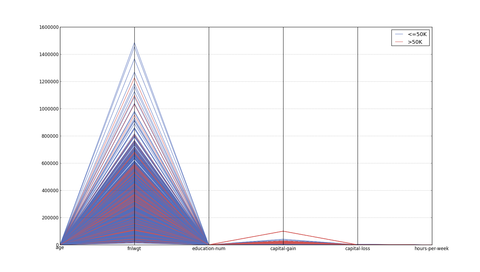

# Quiz 10 - Higher Dimensionality

### Review Question



The above visualization is an...

- Example of a parallel coordinates plot, used effectively
- Example of an andrews plot, demonstrating colored grouping
- Example of an imshow rendering of a linear / line based correlation matrix
- **Example of a parallel coordinates plot, suffering from feature scaling issues**

### Review Question 2

1. Rate BBC's "Planet Earth" television series (1-10)
2. Rate Discovery's "Man vs. Wild" television series (1-10)
3. Rate Paramount's "Star Trek Voyager" television series (1-10)

```
          Q1        Q2        Q3
Q1  1.000000  0.707568  0.014746
Q2  0.707568  1.000000 -0.039130
Q3  0.014746 -0.039130  1.000000
```

Given the above questionnaire and correlation matrix generated from dataset of 1000 responses, what does the 0.707568 value tell you?

- Planet Earth is, on average, rated higher than both Man vs. Wild and Star Trek Voyager
- Star Trek Voyager is the best Star Trek series, since more people like it than the other two shows
- **People who like watching Planet Earth tend to enjoy watching Man vs. Wild**
- There isn't much of a correlation between any of the shows, since 1.00000's only appear in the diagonals