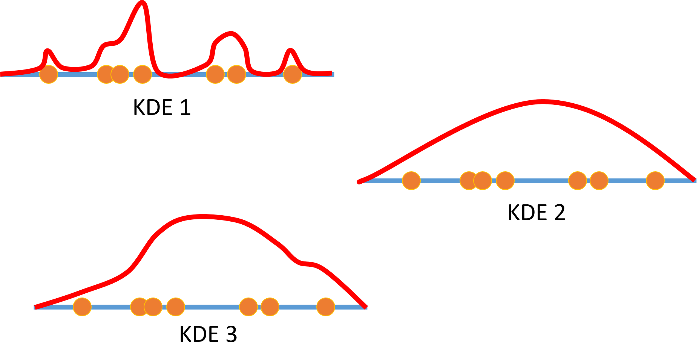

# Final Exam

### Question 1

You have a dataset that consists of time-series data for weather observations over the past ten years. The data includes daily average temperatures.

Into which of the following can you decompose the average temperature data? (choose all that apply):

- Periodic / seasonal temperature patterns
- Maximum and minimum temperatures for each day
- A general trend for temperature over the ten years
- Stationary data that shows random temperature fluctuations
- Temperatures before the ten year observation period

### Question 2

You have a dataset that contains historic rainfall observations.

You want to decompose the rainfall time-series to isolate stationary data.

You will start by using LOESS regression to isolate:

**the general trend**

### Question 3

You are exploring a dataset that contains monthly records for air conditioning usage in an office building.

You have created the following plots of the air conditioning usage and its autocorrelation function.

Which of the following statements is true? (Choose all that apply)

- The data shows a general trend.
- The data is stationary.
- The data shows noticable seasonal variation.
- The data consists of random values and has no time-series structure.

### Question 4

The following image shows three Kernel Density Estimations for incidents of fallen trees on a railway line.

Which of the KDEs is most useful to modeling density of incidents?

- KDE 1
- KDE 2
- **KDE 3**

### Question 5

You are analyzing a corpus of text, and want to find the frequency of words.

You want the frequency counting process to group words with similar meanings together - for example, "teach", "teacher", and "teaching" should be counted as the same word.

Which of the following actions groups related words together?

- Removing stop words from the text corpus
- Normalizing text by removing punctuation and whitespace, and converting all characters to lower case
- **Stemming the words**
- Calculating term frequency-inverse document frequency (TF-IDF)

### Question 6

You have identified that the word "practicum" has a low TF-IDF value within a corpus of mulitple documents.

Which two of the following factors may contribute to the low TF-IDF?

- Most of the documents contain the word "practicum"
- Few of the documents contain the word "practicum"
- The word "practicum" appears very rarely compared to other words
- The word "practicum" appears very often compared to other words

### Question 7

You are processing an image that contains a great deal of "noise", making it hard to distinguish features.

You want to reduce the noise in the image while preserving edges.

What should you do to reduce the noise in the image while preserving edges?

- Apply a Gaussian filter
- **Apply a median filter**
- Use the Sobel edge detection algorithm
- Decrease the size of the image

### Question 8

Dilation...

- Blurs an image to reduce noise
- Detects edges and corners in an image.
- **Adds a boundary of pixels around a bright object in an image.**
- Removes a boundary of pixels around a bright object in an image.